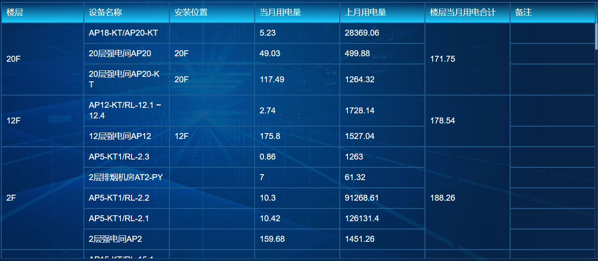

### 导入

```js
import { utils, writeFile } from 'xlsx-js-style'
```

### vue表格

```vue
<el-table
	:data="tableData"
	:span-method="objectSpanMethod"
	v-loading="loading"
	element-loading-text="拼命加载中"
	element-loading-spinner="el-icon-loading"
	element-loading-background="rgba(0, 0, 0, 0.8)"
	height="560"
	style="width: 100%;">
	<el-table-column prop="number" label="编号" width="60">
	</el-table-column>
	<el-table-column prop="name" label="楼层" width="70">
	</el-table-column>
	<el-table-column prop="channelName" label="设备名称"> </el-table-column>
	<el-table-column prop="location" label="安装位置">
	</el-table-column>
	<el-table-column prop="thisMonth" label="当月用电量">
	</el-table-column>
	<el-table-column prop="lastMonth" label="上月用电量">
	</el-table-column>
	<el-table-column prop="totalValue" label="楼层当月用电合计">
	</el-table-column>
	<el-table-column prop="remarks" label="备注">
	</el-table-column>
</el-table>
```

### 控制web界面显示合并单元格

```js
objectSpanMethod({ row, column, rowIndex, columnIndex }) {
	if (columnIndex === 0 || columnIndex === 1 || columnIndex === 6) {
		const _row = this.spanArr[rowIndex];
		const _col = _row > 0 ? 1 : 0;
		return {
			rowspan: _row, //行
			colspan: _col //列
		};
	}
}
```

### 获取普通表格需要合并的数组

```js
//data是正常表格数据
getSpanArr(data) {
    if(data.length == 0){
        return
    }
	this.spanArr = [];
	for (var i = 0; i < data.length; i++) {
		if (i === 0) {
			this.spanArr.push(1);
			this.pos = 0;
		} else {
			// 判断当前元素与上一个元素是否相同
			if (data[i].id && data[i].id === data[i - 1].id) {
				this.spanArr[this.pos] += 1;
				this.spanArr.push(0);
			} else {
				this.spanArr.push(1);
				this.pos = i;
			}
		}
	}
}
```

### 导出合并的表格

```js
exportNh() {
	let listTemp = [["楼层","设备名称","安装位置","当月用电量","上月用电量","楼层当月用电合计","备注"]]
	for (var i = 0; i < this.tableData.length; i++) {
		listTemp.push([this.tableData[i].name,
		this.tableData[i].channelName,
		this.tableData[i].location,
		this.tableData[i].thisMonth,
		this.tableData[i].lastMonth,
		this.tableData[i].totalValue,
		this.tableData[i].remarks])
	}
	var ws = utils.aoa_to_sheet(listTemp)
	if (!ws['!merges']) ws['!merges'] = []
	let begin = 1
	for (var i = 0; i < this.spanArr.length; i++) {
		if(this.spanArr[i] != '0'){
			ws['!merges'].push(utils.decode_range('A'+(begin+1)+':A'+(begin+parseInt(this.spanArr[i]))))
			ws['!merges'].push(utils.decode_range('F'+(begin+1)+':F'+(begin+parseInt(this.spanArr[i]))))
			begin += parseInt(this.spanArr[i])
		}
	}
	//设置宽度
	const cols = [ { wch: 10 },{ wch: 30 },{ wch: 12 },{ wch: 12 },{ wch: 12 },{ wch: 17 },{ wch: 30 } ];
	ws['!cols'] = cols;
	Object.keys(ws).forEach((key) => {
			if (key.indexOf('!') < 0) {
				ws[key].s = {
					font:{
						name:'宋体'
					},
					alignment: {//对齐方式
						horizontal: 'center',//水平居中
						vertical: 'center',//竖直居中
						// wrapText: true,//自动换行
					},
				}
				if (key.charAt(0) == 'A') {
					ws[key].s.font = {
						name:'宋体',
						bold: true,
						sz: 16
					}
				}
			} 
	})
	var wb = utils.book_new()
	utils.book_append_sheet(wb, ws, 'Sheet1')
	writeFile(wb, '能耗报表.xlsx')
}
```

### 实现效果展示



### 参考文章

[sheetJs / xlsx-js-style 纯前端实现导出 excel 表格及自定义单元格样式](https://blog.csdn.net/aibujin/article/details/131633256)

