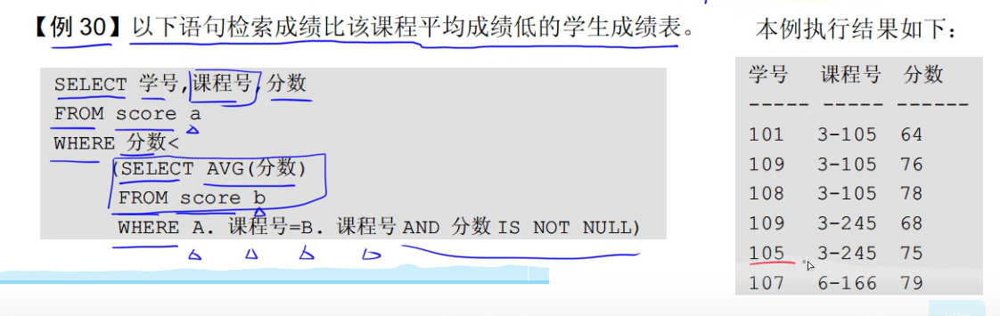

# 三级模式结构

* 概念模式（基本表）
* 外模式（视图）
* 内模式（储存文件）

# 两级映像

* 模式/内模式映像
* 外模式/模式映像

* 数据的物理独立性通过修改模式与内模式之间的映像来完成
* 逻辑独立性通过修改外模式与模式之间的映像来完成

# 关系模式基本术语

* 关系
* 元组
* 属性
* 域
* 关系属性
* 候选码（候选键）
* 主码（主键）
* 主属性
* 外码（外键）
* 全码
* 超码（超键）

# 连接

* θ连接
* 等值连接
* 自然连接

# SQL语言分类

# like

# HAVING

# 相关子查询

# 一般子查询

# 并交差

# 权限

# 索引

# 依赖

# 分布式数据库

# 范式

