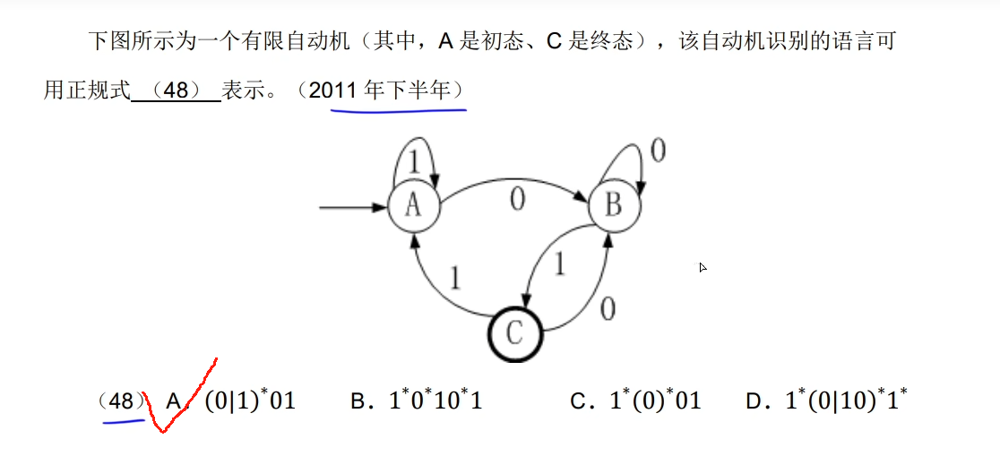

# 编译、解释

* 编译方式：词法分析，语法分析，语义分析，中间代码生成，代码优化，目标代码生成（顺序不可变化）
* 解释方式：词法分析，语法分析，语义分析

* 目标代码生成：编译过程中，寄存器的分配工作在目标代码生成阶段进行
* 语法分析阶段的输入是记号流，输出语法树
* 语义分析只能检测出程序的静态语义错误，不能检测出动态的语义错误，要到程序运行时才能检测出来

* 中间代码：后缀式，三地址码，三元式，四元式，树（图）等形式

* 正规式

* 有限自动机（NFA或DFA）是进行词法分析的适当工具

# 中间代码生成

# 上下文无关文法

大多数程序设计语言的语法规则用上下文无关文法描述

# 后缀式（逆波兰式）

可以用栈求值

# 堆栈

栈区一般在进行函数调用和返回时由系统进行控制和管理，堆区由用户在程序中根据需要申请和释放

# 习题

