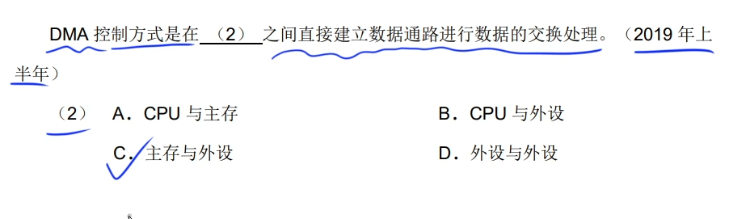
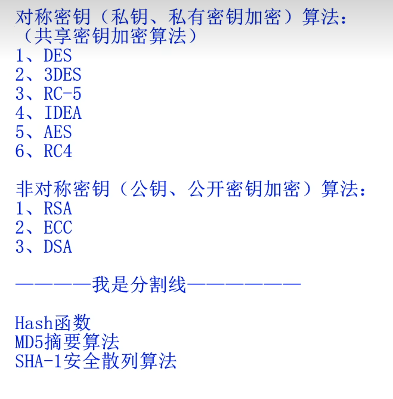
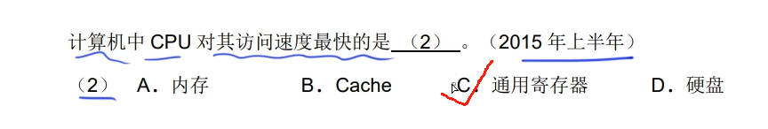
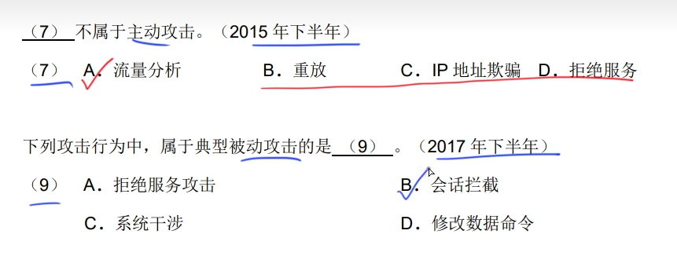

# CPU的功能

* 程序控制
* 操作控制
* 时间控制
* 数据处理

# 运算器

* 算数逻辑单元（ALU）
* 累加寄存器（AC）
* 数据缓冲寄存器（DR）
* 状态条件寄存器（PSW）

# 控制器

不仅要保证程序的正确执行，而且要能够处理异常事件

* 指令寄存器（IR）
* 程序计数器（PC）
* 地址寄存器（AR）
* 指令译码器（ID）

# 数据表示

正数的反码与原码相同，补码也相同

移码就是先取补码，然后将符号位转变，就是移码

如果是8位，反码和原码范围：-127~+127

补码和移码范围：-128~+127

# 寻址

* 立即寻址：操作数就包含在指令中
* 直接寻址：操作数存放在内存单元中，指令中直接给出操作数所在存储单元的地址
* 寄存器寻址：操作数存放在某一寄存器中，指令中给出存放操作数的寄存器名
* 寄存器间接寻址：操作数存放在内存单元中，操作数所在存储单元的地址在某个寄存器中
* 间接寻址
* 相对寻址
* 变址寻址

# 校验码

* 海明码

海明码利用奇偶性进行纠错和检错

公式：2^k-1>=n+k

* 循环冗余校验码

采用模2运算来构造校验位

k个数据位之后跟r个校验位

# RISC与CISC

# 存储器

* 相联存储器是指按内容访问的存储器

* 按寻址方式分类

随机存储器，顺序存储器，直接存储器

* 常用的虚拟存储器由（主存-辅存）两级存储器组成

* 计算机系统的主存是由DRAM（动态随机存储器）构成的，DRAM需要通过周期性刷新来保持数据
* cache容量越大，命中率越高，cache与主存地址的映射是由硬件自动完成的

* cache的映像方式（全相联，组相联，直接）冲突率由低到多

# 中断

* 中断向量：提供中断服务程序的入口地址
* 中断响应时间：发出中断请求开始，到进入中断服务程序
* 保存现场：返回来执行原程序

# 输入输出（I/O）控制方式

* 程序查询方式（CPU和I/O外设只能串行工作）
* 中断驱动方式（可并行）字传送
* 直接存储器存取方式 DMA（可并行），设备与主存间的数据块传送无需cpu干预  ，  块传送  ，由外设直接将数据放入内存 

# 公钥和私钥

* 公钥（加密，认证）
* 私钥（解密，签名）
* 数字签名是对真实性的保护（s发送就用s的私钥进行签名，接收方用s的公钥验证信息的真实性）

# 非对称密钥算法

* RSA
* ECC
* DSA

MD5是摘要算法 加密完长度为128位

# 习题

